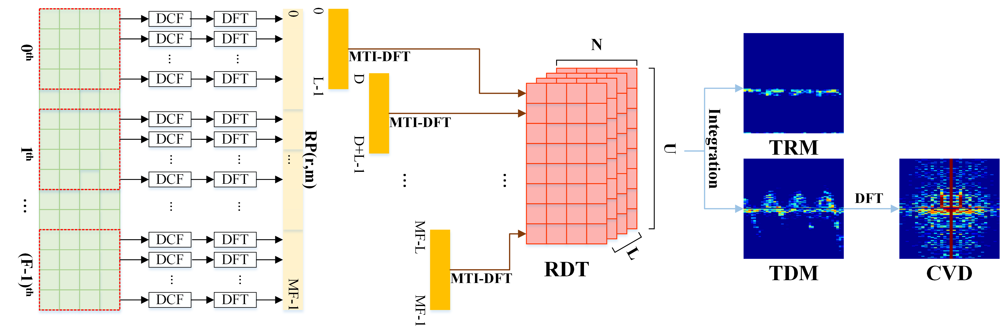

### Write in front

We hope that readers will acknowledge our work by citing it when using our datasets or code.

Our related work based on this dataset currently has one formal published work (`ICARCV2022`), one minor revision work in review (`IEEE GRSL`) and one work in submission(`IEEE Sensor Journal`). The reader can cite our current published work as follows:

​	[1] X. Yu, Z. Cao, Z. Wu, C. Song, J. Zhu and Z. Xu, "A Novel Potential Drowning Detection System Based on Millimeter-Wave Radar," 2022 17th International Conference on Control, Automation, Robotics and Vision (ICARCV), Singapore, Singapore, 2022, pp. 659-664, doi: 10.1109/ICARCV57592.2022.10004245.

​	[2] X. Yu, Z. Cao, Z. Wu, C. Song and Z. Xu, "Sample Intercorrelation-Based Multidomain Fusion Network for Aquatic Human Activity Recognition Using Millimeter-Wave Radar," in IEEE Geoscience and Remote Sensing Letters, vol. 20, pp. 1-5, 2023, Art no. 3505205, doi: 10.1109/LGRS.2023.3284395.

​ 	[3] Z. Wu, Z. Cao, X. Yu, C. Song, J. Zhu and Z. Xu, "A Novel Multi-Person Activity Recognition Algorithm Based on Point Clouds Measured by Millimeter-Wave MIMO Radar", in IEEE Sensor Journal, 2023, 	doi: 10.1109/JSEN.2023.3283778.

### AHAR TASK

#### AHAR-I

​	Based on the TI AWR1243BOOST millimeter-wave radar, we completed the first version of the aquatic human activity recognition (AHAR-I) dataset, in which the millimeter wave radar parameters are configured as shown in the following table.

|           Patrameter Name           | Accurate Value |
| :---------------------------------: | :------------: |
|       Starting Frequency(GHZ)       |       77       |
|    Frequency Slope (MHZ/ $\mu$s)    |     46.397     |
|         Idel Time ($\mu$s)          |     30.00      |
|       Ramp End Time ($\mu$s)        |     80.00      |
|          Sample Rate(ksps)          |      6847      |
|     Periodicity Per Frame (ms)      |     100.00     |
|   Number of ADC Points Per Chirp    |      256       |
|        Number of Chirp Loops        |      128       |
| Valid Azimuth Field of View (VAFOV) |    -60°~60°    |

​	In AHAR-I dataset, we collected nine classes of aquatic human activities, including struggling, drowning, floating with a ring, swimming with a ring, pulling a ring, backstroke, breaststroke, freestyle and waving for help, and the number and duration of raw data files for each acitivty are shown in the table below. Among them, three swimming-like activities and lap-pulling activities were adopted in a continuous 400-frame acquisition mode, and the other five aquatic human activities were adopted in a continuous 200-frame acquisition mode.

|   Activity Type    | # of data files | Total duration (sec) |
| :----------------: | :-------------: | :------------------: |
| Distress(Struggle) |       32        |         600          |
|      Drowning      |       40        |         799          |
| Float with a ring  |       30        |         600          |
|  Swim with a ring  |       30        |         501          |
|    Pull a ring     |       13        |         516          |
|     Backstroke     |       20        |         655          |
|     Breastroke     |       18        |         639          |
|     Freestyle      |       18        |         635          |
|   Wave for help    |       30        |         600          |

​	In order to better promote the research and development in the topic/field of aquatic humanactivity recognition, we now make the relevant millimeter wave radar raw dataset publicly available. 

```
AHAR-I download link：https://pan.baidu.com/s/1r1EoYE4SxeX-yP5mz0Co-A 
link password：2l34 
```

​	In addition to this, we will further share our work based on AHAR-I (Two-Stage-Fusion Network, TSFNet), which was published in the international computer conference `ICARCV 2022`.  We sincerely hope that readers or users using our dataset and codes can cite our work,

​	We sincerely hope that readers or users who use our datasets and code will cite our work, as we consider it a sign of recognition and respect for our work.

​	[1] X. Yu, Z. Cao, Z. Wu, C. Song, J. Zhu and Z. Xu, "A Novel Potential Drowning Detection System Based on Millimeter-Wave Radar," 2022 17th International Conference on Control, Automation, Robotics and Vision (ICARCV), Singapore, Singapore, 2022, pp. 659-664, doi: 10.1109/ICARCV57592.2022.10004245.

#### AHAR-II

​	In the second version of the aquatic human activity recognition (AHAR-II) dataset, we added an aquatic human activity, namely frolicking, based on the AHAR-I. We then investigated the effects of covariances in different background environments (deep water, shallow water), different users (user 1, user 2) and different aspect-angles (radial and non-radial) on the recognition of aquatic human activities, respectively.

​	We divided the radar data collected based on the above covariances into six different variable domains, as shown in the following table.

|      Index      |             Domain Setting              |
| :-------------: | :-------------------------------------: |
| $\mathcal{D}_1$ |   subject 1,radial,shallow water area   |
| $\mathcal{D}_2$ |   subject 2,radial,shallow water area   |
| $\mathcal{D}_3$ | subject 1,non-radial,shallow water area |
| $\mathcal{D}_4$ | subject 2,non-radial,shallow water area |
| $\mathcal{D}_5$ |    subject 1,radial,deep water area     |
| $\mathcal{D}_6$ |    subject 2,radial,deep water area     |

​	Information on the number of radar raw data files acquired for different aquatic human activities under each variable domain is shown below, where 300 consecutive frames (30s) were acquired for each file. 

|                 | $A_1$ | $A_2$ | $A_3$ | $A_4$ | $A_5$ | $A_6$ | $A_7$ | $A_8$ | $A_9$ | $A_{10}$ | ALL  |
| :-------------: | :---: | :---: | :---: | :---: | :---: | :---: | :---: | :---: | :---: | :------: | :--: |
| $\mathcal{D}_1$ |  10   |  10   |  10   |  11   |  11   |  12   |  13   |  13   |  10   |    10    | 110  |
| $\mathcal{D}_2$ |  12   |  11   |  11   |  10   |  12   |  10   |  10   |  11   |  10   |    11    | 108  |
| $\mathcal{D}_3$ |   7   |   6   |   8   |   8   |   8   |   6   |   8   |   8   |  11   |    7     |  77  |
| $\mathcal{D}_4$ |   7   |   6   |   8   |   8   |   8   |   6   |   7   |   8   |  10   |    7     |  75  |
| $\mathcal{D}_5$ |   7   |   7   |   8   |   8   |   8   |   7   |  10   |   8   |   6   |    6     |  75  |
| $\mathcal{D}_6$ |   7   |   7   |   9   |   8   |   7   |   7   |   7   |   8   |   7   |    7     |  74  |

​	Note: The aquatic human activities corresponding to `A1-A10` are: struggling(distressing), drowning, freestyle, breaststroke backstroke, floating with a ring, swimming with a ring, pulling a ring, frolicking, and waving.

​	In addition,  we also provide a partial two-person aquatic human activity recognition dataset and a single-person continuous different aquatic human activity flow dataset, which can be used for testing the algorithm performance.

​	

### Real-Time Dara- Processing System

#### Parameter Computer

```matlab
function [params] = AutoCalculator(Slope, adcNum, chirpNum, fsample, ramptime, ideltime, mode)
    % Slope
    % adcNum
    % chirpNum
    % fsample
    % ramptime
    % ideltime
    % mode： complex1x complex2x real
    
    f0 = 77e9; % center frequency
    txNum = 3; % num of tx
    TC = (ramptime + ideltime) * txNum; % duration of per Chirp in TDMA
    TF = chirpNum * TC; % frame time

    validB = 1 / fsample * adcNum * Slope; % valid bandwidth
    totalB = ramptime * Slope; % total bandwidth
    rangeRes = 3e8 / (2 * validB); % range resolution
    maxRange = 3e8 * fsample / (2 * Slope); % maximum range
    if mode == "complex1x"
        maxRange = maxRange;
    else %  the maximum detectable range should be divided by two in complex2x and real mode
        maxRange = maxRange / 2;
    end
    
    velocityRes = 3e8 / (2 *  TF * f0); % velocity resolution
    maxVelocity = 3e8 / (4 * f0 * TC); % maximum detectable velocity
    
    params = {};
    params.rangeRes = rangeRes;
    params.maxRange = maxRange;
    params.velocityRes = velocityRes;
    params.maxVelocity = maxVelocity;
    
    disp(["valid bandwidth(MHZ):",num2str(validB/1e6),"total bandwidth(MHZ):",num2str(totalB/1e6)]);
    disp(["range resolution(m):",num2str(rangeRes),"velocity resolution(m/s):",num2str(velocityRes)]);
    disp(["maximum detectable range(m):",num2str(maxRange),"maximum detectable velocity(m/s):",num2str(maxVelocity)])
end
```

```matlab
clc;clear;close all;
% By Xuliang,22134033@zju.edu.cn
% FUNC: To calculate some params such as range/velocity resolution,etc

Slope = 46.397e12; 
adcNum = 256; 
chirpNum = 128;
fsample = 6847e3;
ramptime = 80e-6; 
ideltime = 30e-6;
mode = "complex2x";

[params] = AutoCalculator(Slope, adcNum, chirpNum, fsample, ramptime, ideltime, mode);
```

#### Real-Time System

##### Preparation

​	You need to prepare your `DataCaptureDemo_1243.lua` and `CaptureData1243.lua` firstly. In the following, we provide the script files we used to capture the AHAR dataset, which we hope to provide the reader with a reference.

```lua
-----------------------------------DataCaptureDemo_1243.lua-----------------------------------

ar1.FullReset()
ar1.SOPControl(2)
ar1.Connect(4,115200,1000)
-- In fact, we do not recommend using the above command, although it frees our hands, it may cause instability in the radar acquisition data. 

--BSS and MSS firmware download
info = debug.getinfo(1,'S');
file_path = (info.source);
file_path = string.gsub(file_path, "@","");
file_path = string.gsub(file_path, "DataCaptureDemo_1243_5.lua","");
fw_path   = file_path.."..\\..\\rf_eval_firmware"

--Export bit operation file
bitopfile = file_path.."\\".."bitoperations.lua"
dofile(bitopfile)

--Read part ID
--This register address used to find part number for ES2 and ES3 devices
res, efusedevice = ar1.ReadRegister(0xFFFFE214, 0, 31)
res, efuseES1device = ar1.ReadRegister(0xFFFFE210, 0, 31)
efuseES2ES3Device = bit_and(efusedevice, 0x03FC0000)
efuseES2ES3Device = bit_rshift(efuseES2ES3Device, 18)

--if part number is zero then those are ES1 devices 
if(efuseES2ES3Device == 0) then
	if (bit_and(efuseES1device, 3) == 0) then
		partId = 1243
	elseif (bit_and(efuseES1device, 3) == 1) then
		partId = 1443
	else
		partId = 1642
	end
elseif(efuseES2ES3Device == 0xE0 and (bit_and(efuseES1device, 3) == 2)) then
		partId = 6843
		ar1.frequencyBandSelection("60G")
--if part number is non-zero then those are ES12 and ES3 devices
else
   if(efuseES2ES3Device == 0x20 or efuseES2ES3Device == 0x21 or efuseES2ES3Device == 0x80) then
		partId = 1243
	elseif(efuseES2ES3Device == 0xA0 or efuseES2ES3Device == 0x40)then
		partId = 1443
	elseif(efuseES2ES3Device == 0x60 or efuseES2ES3Device == 0x61 or efuseES2ES3Device == 0x04 or efuseES2ES3Device == 0x62 or efuseES2ES3Device == 0x67) then
		partId = 1642
	elseif(efuseES2ES3Device == 0x66 or efuseES2ES3Device == 0x01 or efuseES2ES3Device == 0xC0 or efuseES2ES3Device == 0xC1) then
		partId = 1642
	elseif(efuseES2ES3Device == 0x70 or efuseES2ES3Device == 0x71 or efuseES2ES3Device == 0xD0 or efuseES2ES3Device == 0x05) then
		partId = 1843
	elseif(efuseES2ES3Device == 0xE0 or efuseES2ES3Device == 0xE1 or efuseES2ES3Device == 0xE2 or efuseES2ES3Device == 0xE3 or efuseES2ES3Device == 0xE4) then
		partId = 6843
		ar1.frequencyBandSelection("60G")
	else
		WriteToLog("Inavlid Device part number in ES2 and ES3 devices\n" ..partId)
    end
end 

--ES version
res, ESVersion = ar1.ReadRegister(0xFFFFE218, 0, 31)
ESVersion = bit_and(ESVersion, 15)

--ADC_Data file path
--data_path     = file_path.."..\\PostProc"
--adc_data_path = "C:\\ti\\mmwave_studio_02_01_01_00\\mmWaveStudio\\PostProc\\adc_data.bin"
data_path     = "H:\\RadarProcessing\\DataFile\\TestData"
adc_data_path = "H:\\RadarProcessing\\DataFile\\TestData\\adc_data.bin"
-- Path above mentioned can be changed according to your requirements

-- Download Firmware
if(partId == 1642) then
    BSS_FW    = fw_path.."\\radarss\\xwr16xx_radarss.bin"
    MSS_FW    = fw_path.."\\masterss\\xwr16xx_masterss.bin"
elseif(partId == 1243) then
    BSS_FW    = fw_path.."\\radarss\\xwr12xx_xwr14xx_radarss_ES2.0.bin"
    MSS_FW    = fw_path.."\\masterss\\xwr12xx_xwr14xx_masterss_ES2.0.bin"
elseif(partId == 1443) then
    BSS_FW    = fw_path.."\\radarss\\xwr12xx_xwr14xx_radarss.bin"
    MSS_FW    = fw_path.."\\masterss\\xwr12xx_xwr14xx_masterss.bin"
elseif(partId == 1843) then
    BSS_FW    = fw_path.."\\radarss\\xwr18xx_radarss.bin"
    MSS_FW    = fw_path.."\\masterss\\xwr18xx_masterss.bin"
elseif(partId == 6843) then
    BSS_FW    = fw_path.."\\radarss\\xwr68xx_radarss.bin"
    MSS_FW    = fw_path.."\\masterss\\xwr68xx_masterss.bin"
else
    WriteToLog("Invalid Device partId FW\n" ..partId)
    WriteToLog("Invalid Device ESVersion\n" ..ESVersion)
end

-- Download BSS Firmware
if (ar1.DownloadBSSFw(BSS_FW) == 0) then
    WriteToLog("BSS FW Download Success\n", "green")
else
    WriteToLog("BSS FW Download failure\n", "red")
end

-- Download MSS Firmware
if (ar1.DownloadMSSFw(MSS_FW) == 0) then
    WriteToLog("MSS FW Download Success\n", "green")
else
    WriteToLog("MSS FW Download failure\n", "red")
end

-- Download MSS Firmware
if (ar1.DownloadMSSFw(MSS_FW) == 0) then
    WriteToLog("MSS FW Download Success\n", "green")
else
    WriteToLog("MSS FW Download failure\n", "red")
end

-- SPI Connect
if (ar1.PowerOn(1, 1000, 0, 0) == 0) then
    WriteToLog("Power On Success\n", "green")
else
   WriteToLog("Power On failure\n", "red")
end

-- RF Power UP
if (ar1.RfEnable() == 0) then
    WriteToLog("RF Enable Success\n", "green")
else
    WriteToLog("RF Enable failure\n", "red")
end

if (ar1.ChanNAdcConfig(1, 1, 1, 1, 1, 1, 1, 2, 2, 0) == 0) then
    WriteToLog("ChanNAdcConfig Success\n", "green")
else
    WriteToLog("ChanNAdcConfig failure\n", "red")
end


if (partId == 1642) then
    if (ar1.LPModConfig(0, 1) == 0) then
        WriteToLog("LPModConfig Success\n", "green")
    else
        WriteToLog("LPModConfig failure\n", "red")
    end
else
    if (ar1.LPModConfig(0, 0) == 0) then
        WriteToLog("Regualar mode Cfg Success\n", "green")
    else
        WriteToLog("Regualar mode Cfg failure\n", "red")
    end
end

if (ar1.RfInit() == 0) then
    WriteToLog("RfInit Success\n", "green")
else
    WriteToLog("RfInit failure\n", "red")
end

RSTD.Sleep(1000)

if (ar1.DataPathConfig(1, 1, 0) == 0) then
    WriteToLog("DataPathConfig Success\n", "green")
else
    WriteToLog("DataPathConfig failure\n", "red")
end

if (ar1.LvdsClkConfig(1, 1) == 0) then
    WriteToLog("LvdsClkConfig Success\n", "green")
else
    WriteToLog("LvdsClkConfig failure\n", "red")
end

if((partId == 1642) or (partId == 1843) or (partId == 6843)) then
    if (ar1.LVDSLaneConfig(0, 1, 1, 0, 0, 1, 0, 0) == 0) then
        WriteToLog("LVDSLaneConfig Success\n", "green")
    else
        WriteToLog("LVDSLaneConfig failure\n", "red")
    end
elseif ((partId == 1243) or (partId == 1443)) then
    if (ar1.LVDSLaneConfig(0, 1, 1, 1, 1, 1, 0, 0) == 0) then
        WriteToLog("LVDSLaneConfig Success\n", "green")
    else
        WriteToLog("LVDSLaneConfig failure\n", "red")
    end
end

-- if (ar1.SetTestSource(4, 3, 0, 0, 0, 0, -327, 0, -327, 327, 327, 327, -2.5, 327, 327, 0, 0, 0, 0, -327, 0, -327, 
                      -- 327, 327, 327, -95, 0, 0, 0.5, 0, 1, 0, 1.5, 0, 0, 0, 0, 0, 0, 0) == 0) then
    -- WriteToLog("Test Source Configuration Success\n", "green")
-- else
    -- WriteToLog("Test Source Configuration failure\n", "red")
-- end

if((partId == 1642) or (partId == 1843)) then
    if(ar1.ProfileConfig(0, 77, 100, 6, 60, 0, 0, 0, 0, 0, 0, 29.982, 0, 256, 5000, 0, 0, 30) == 0) then
        WriteToLog("ProfileConfig Success\n", "green")
    else
        WriteToLog("ProfileConfig failure\n", "red")
    end
elseif((partId == 1243) or (partId == 1443)) then
    if(ar1.ProfileConfig(0, 77, 30, 6, 80, 0, 0, 0, 0, 0, 0, 46.397, 0, 256, 6847, 0, 0, 30) == 0) then
        WriteToLog("ProfileConfig Success\n", "green")
    else
        WriteToLog("ProfileConfig failure\n", "red")
    end
elseif(partId == 6843) then
    if(ar1.ProfileConfig(0, 60.25, 200, 6, 60, 0, 0, 0, 0, 0, 0, 29.982, 0, 128, 10000, 0, 131072, 30) == 0) then
		WriteToLog("ProfileConfig Success\n", "green")
    else
        WriteToLog("ProfileConfig failure\n", "red")
    end
end

if (ar1.ChirpConfig(0, 0, 0, 0, 0, 0, 0, 1, 0, 0) == 0) then
    WriteToLog("ChirpConfig Success\n", "green")
else
    WriteToLog("ChirpConfig failure\n", "red")
end

if (ar1.ChirpConfig(2, 2, 0, 0, 0, 0, 0, 0, 1, 0) == 0) then
    WriteToLog("ChirpConfig Success\n", "green")
else
    WriteToLog("ChirpConfig failure\n", "red")
end

if (ar1.ChirpConfig(1, 1, 0, 0, 0, 0, 0, 0, 0, 1) == 0) then
    WriteToLog("ChirpConfig Success\n", "green")
else
    WriteToLog("ChirpConfig failure\n", "red")
end

-- if (ar1.EnableTestSource(1) == 0) then
    -- WriteToLog("Enabling Test Source Success\n", "green")
-- else
    -- WriteToLog("Enabling Test Source failure\n", "red")
-- end

if (ar1.FrameConfig(0, 2, 300, 128, 100, 0, 0, 1) == 0) then
    WriteToLog("FrameConfig Success\n", "green")
else
    WriteToLog("FrameConfig failure\n", "red")
end

-- select Device type
if (ar1.SelectCaptureDevice("DCA1000") == 0) then
    WriteToLog("SelectCaptureDevice Success\n", "green")
else
    WriteToLog("SelectCaptureDevice failure\n", "red")
end

--DATA CAPTURE CARD API
if (ar1.CaptureCardConfig_EthInit("192.168.33.30", "192.168.33.180", "12:34:56:78:90:12", 4096, 4098) == 0) then
    WriteToLog("CaptureCardConfig_EthInit Success\n", "green")
else
    WriteToLog("CaptureCardConfig_EthInit failure\n", "red")
end

--AWR12xx or xWR14xx-1, xWR16xx or xWR18xx or xWR68xx- 2 (second parameter indicates the device type)
if ((partId == 1642) or (partId == 1843) or (partId == 6843)) then
    if (ar1.CaptureCardConfig_Mode(1, 2, 1, 2, 3, 30) == 0) then
        WriteToLog("CaptureCardConfig_Mode Success\n", "green")
    else
        WriteToLog("CaptureCardConfig_Mode failure\n", "red")
    end
elseif ((partId == 1243) or (partId == 1443)) then
    if (ar1.CaptureCardConfig_Mode(1, 1, 1, 2, 3, 30) == 0) then
        WriteToLog("CaptureCardConfig_Mode Success\n", "green")
    else
        WriteToLog("CaptureCardConfig_Mode failure\n", "red")
    end
end

if (ar1.CaptureCardConfig_PacketDelay(25) == 0) then
    WriteToLog("CaptureCardConfig_PacketDelay Success\n", "green")
else
    WriteToLog("CaptureCardConfig_PacketDelay failure\n", "red")
end

--Start Record ADC data
ar1.CaptureCardConfig_StartRecord(adc_data_path, 1)
RSTD.Sleep(1000)
```

```lua
-----------------------------------CaptureData1243.lua-----------------------------------

adc_data_path="H:\\MyDataset\\DatasetFile\\CT10\\adc_data.bin"
ar1.CaptureCardConfig_StartRecord(adc_data_path, 1)
RSTD.Sleep(1000)
ar1.StartFrame()
```

##### Capture Files

​	When you start the `mmwave-studio`, you can run `RadarConfigure.m` file in your MATLAB interface and it will send the parameter configuration script file `DataCaptureDemo_1243.lua` to the `mmwave-studio`; when you wait until the `mmwave-studio` is configured, i.e., after all status indications are green connected, you can run the `CaptureData.m` file.

​	In proper operation, you will see the millimeter wave radar begin to collect data and the graphical interface will update the range-time and Doppler-time maps in real time. 

​	In addition to the above work, we provide simple APP tools that integrate data acquisition, real-time signal processing, and SVM for recognition, etc. The reader can read the relevant code for improvement. You can find these in` RealTime-APP` folder.

```matlab
function RadarConfigure
	% By Xuliang,22134033@zju.edu.cn
	% You need to run this file when you open mmwave studio
	% FUNC: Transport parameter configuration lua file to mmwave studio
    addpath(genpath('.\'))
    RSTD_DLL_Path = 'C:\ti\mmwave_studio_02_01_01_00\mmWaveStudio\Clients\RtttNetClientController\RtttNetClientAPI.dll';
    ErrStatus = Init_RSTD_Connection(RSTD_DLL_Path);  # you can find this function in my blog concerned with hardware configuration: https://www.cnblogs.com/yuxuliang/p/MyRadar_6.html
    if (ErrStatus ~= 30000)
        disp('Error inside Init_RSTD_Connection');
        return;
    end
	strFilename='C:\\ti\\mmwave_studio_02_01_01_00\\mmWaveStudio\\Scripts\\DataCaptureDemo_1243.lua'; 
    Lua_String = sprintf('dofile("%s")',strFilename);
    ErrStatus = RtttNetClientAPI.RtttNetClient.SendCommand(Lua_String);
end
```

```matlab
function SendCaptureCMD(data_name)
	%% By Xuliang,22134033@zju.edu.cn
	%% FUNC: to send data-capture command lua file to mmwave-studio
    root_path = 'H:\MyDataset\DatasetFile\'; % you need to modify
    data_path = strcat(root_path,data_name); 
    mkdir(data_path); 
    
    % you need to correct 
    str1 = strcat('adc_data_path="H:\\MyDataset\\DatasetFile\\',data_name,'\\adc_data.bin"'); 
    str = [str1,"ar1.CaptureCardConfig_StartRecord(adc_data_path, 1)","RSTD.Sleep(1000)","ar1.StartFrame()"];
    fid = fopen('C:\ti\mmwave_studio_02_01_01_00\mmWaveStudio\Scripts\CaptureData1243.lua','w');
    for i = 1:length(str)
        fprintf(fid,'%s\n',str(i));
    end
    fclose(fid); 
    
    addpath(genpath('.\'))
    % Initialize mmWaveStudio .NET connection
    RSTD_DLL_Path = 'C:\ti\mmwave_studio_02_01_01_00\mmWaveStudio\Clients\RtttNetClientController\RtttNetClientAPI.dll';
    ErrStatus = Init_RSTD_Connection(RSTD_DLL_Path);
    if (ErrStatus ~= 30000)
        disp('Error inside Init_RSTD_Connection');
        return;
    end
    strFilename = 'C:\\ti\\mmwave_studio_02_01_01_00\\mmWaveStudio\\Scripts\\CaptureData1243.lua';
    Lua_String = sprintf('dofile("%s")',strFilename);
    ErrStatus = RtttNetClientAPI.RtttNetClient.SendCommand(Lua_String);
end

```

```matlab
%% By Xuliang,22134033@zju.edu.cn
%% FUNC: REAL-TIME DATA-CAPTURING AND PROCESSING SYSTEM

clc;clear;close all;

% wave/swim with buoys/pull with buoys/frolic/freestyle/float with
% buoys/drown/distress/breaststroke/backstroke
root_path = 'H:\MyDataset\DatasetFile\wave\'; 
data_name = 'TEST1'; % you can correct this to mkdir file folder and rename it
data_path = strcat(root_path,data_name);

%% RADAR CONFIGURATION
F0 = 77e9; % center frequency
c = physconst('lightspeed'); % speed of light
LAMBDA = c / F0; % wave length
D = LAMBDA / 2; % antenna spacing
TX_NUM = 3; % num of tx

SLOPE = 46.397e12; % frequency slope
ADC_SAMPLE = 512; % ADC sample points/ fast-time sample points
FS_SAMPLE = 6182e3; % sample frequency
IDEL_TIME = 30e-6; 
RAMP_TIME = 85e-6; 
CHIRP_NUM = 128; % num of chirps
TC = (IDEL_TIME + RAMP_TIME) * TX_NUM; % duration per chirp sequence of TDM
TF = TC * CHIRP_NUM; % frame time
RANGE_RES = 3e8 / (2 * 1 / FS_SAMPLE * ADC_SAMPLE * SLOPE); % range resolution
RANGE_AXIS = [-ADC_SAMPLE / 2 : ADC_SAMPLE / 2-1] * RANGE_RES; % range index
VELOCITY_RES = 3e8 / (2 * F0 * TF); % velocity resolution 
VELOCITY_AXIS = [-CHIRP_NUM / 2 : CHIRP_NUM / 2 - 1] * VELOCITY_RES; % velocity index

adc_file_name = strcat(data_path,'\adc_data_Raw_0.bin'); 
SendCaptureCMD(data_name); % to send data-capture command lua file 
pause(0.1);
FID = fopen(adc_file_name,'r'); % to read bin
rt_show = [];
dt_show = [];
FRAME_SET = [];
init_frame = 0;
while(true)
    D = dir(adc_file_name); % to detect whether there exists bin file in this folder
	path_size = D.bytes / 1024; 
	if path_size ~= 0 
        NUMADCBITS = 16; 
        NUMLANES = 4; 
        ISREAL = 0;
        
        ADCDATA = fread(FID,'int16');

        if NUMADCBITS ~= 16
            LMAX = 2^(NUMADCBITS-1)-1;
            ADCDATA(ADCDATA > LMAX) = ADCDATA(ADCDATA > LMAX) - 2^NUMADCBITS;
        end

        if ISREAL
            ADCDATA = reshape(ADCDATA, NUMLANES, []); 
        else 
            ADCDATA = reshape(ADCDATA, NUMLANES*2, []);
            ADCDATA = ADCDATA([1,2,3,4],:) + sqrt(-1)*ADCDATA([5,6,7,8],:);
        end
        data = ADCDATA(1,:); 
        
        max_frame = floor(size(data,2)/(ADC_SAMPLE*TX_NUM*CHIRP_NUM)); 
        if max_frame ~= 0
            RX1_DATA = reshape(data(1:ADC_SAMPLE*TX_NUM*CHIRP_NUM*max_frame),ADC_SAMPLE,TX_NUM,CHIRP_NUM,max_frame);

            TX1_DATA = squeeze(RX1_DATA(:,1,:,:));
            range_plane = zeros(ADC_SAMPLE/2,max_frame);
            micro_doppler = zeros(CHIRP_NUM,max_frame);
            for frame_idx = 1:max_frame
                adc_data = squeeze(TX1_DATA(:,:,frame_idx));
                adc_data = adc_data - mean(adc_data,1); 
                adc_data = adc_data .* hanning(ADC_SAMPLE);
                range_profile = fft(adc_data,ADC_SAMPLE,1); 
                range_profile = range_profile - repmat(mean(range_profile'),size(range_profile,2),1)'; 
                doppler_profile = fftshift(fft(range_profile,CHIRP_NUM,2),2); 

                dsum = abs(doppler_profile).^2;
                rsum = sum(dsum(1:end/2,:),2);
                vsum = sum(dsum(1:end/2,:),1);
                range_plane(:,frame_idx) = rsum;
                micro_doppler(:,frame_idx) = vsum;
            end
        	
        	% to generate range-time maps 
            init_frame = init_frame + max_frame;
            FRAME_SET = 1:init_frame;
            axis xy;
            subplot(121);
            rt_show = [rt_show,db(abs(range_plane))/2];
            imagesc(FRAME_SET*100/1e3,RANGE_AXIS(end/2+1:end),rt_show);
            xlabel('Frame Period(s)');ylabel('Range(m)');
            colormap(jet);caxis([80 110]);
            
            % to generate doppler-time maps 
            axis xy;
            subplot(122);
            dt_show = [dt_show,(db(abs(micro_doppler)))/2];
            imagesc(FRAME_SET*100/1e3,VELOCITY_AXIS,dt_show);
            xlabel('Frame Period(s)');ylabel('Velocity(m/s)');
            colormap(jet);caxis([80 110]);
            pause(0.01); 
        end
    end
    if path_size == 460800/10 % you need to modify this accoreding to your bin size
        fclose(FID); % clos bin file 
        break; % if data-capture is complete then break
    end
end
```

#### Dataset Processing

​	In the following, we provide a block diagram of the radar signal processing flow in our work, which the reader can understand by combining the block diagram and the given codes. In addition, we also provide the `PPT` of `ICARCV2022 `oral presentation to help with understanding.



##### AHAR-I

​	In the radar signal processing of AHAR-I, we provide SVM cases for manual extraction of statistical features from feature spectra along with multi-feature domain spectra generation, and the reader can further study and improve on this work.

```matlab
% By Xuliang,22134033@zju.edu.cn
% FUNC:Batch folder processing of radar data for each aquactic human activity is performed to generate range-time maps, 
% Doppler-time maps, cadence velocity diagrams and SVM feature extraction datasets.

clc;clear;close all;
data_path = 'H:\RadarProcessing\DataFile\PaperData\';
act = 'freestyle';
real_data_path = strcat(data_path,act,'\');
files = dir(real_data_path);

f0 = 77e9; 
c = physconst('lightspeed'); 
lambda = c / f0; 
D = lambda / 2; 
num_rx = 4; 
num_tx = 3; 
chirp_num = 128; 

idel_time = 30e-6; 
ramp_time = 80e-6; 
TC = (idel_time + ramp_time) * num_tx; 
TF = TC * chirp_num;
frame_length = 200; 
overlap = 0.25;
slope = 46.397e12;
adc_sample = 256; 
fs_sample = 6874e3; 
range_res = 3e8 / (2 * 1 / fs_sample * adc_sample * slope); 
range_fft_sample = 256; 
doppler_fft_sample = 128; 
% range_axis = [-range_fft_sample / 2 : range_fft_sample / 2 - 1] * range_res / (range_fft_sample / adc_sample); 
range_axis = [1 : range_fft_sample] * range_res / (range_fft_sample / adc_sample); 
velocity_res = 3e8 / (2 * f0 * TF); 
velocity_axis = [-doppler_fft_sample / 2 : doppler_fft_sample / 2 - 1] * velocity_res / (doppler_fft_sample / chirp_num);
frame_axis = (1:frame_length/overlap)*100/1000*overlap;

for idx = 3:length(files)
    file_path = strcat(real_data_path,files(idx).name,'\');
    son_file = dir(file_path);
    bin_path = strcat(file_path,son_file(4).name);
    [ADC_DATA] = readDCA1000(bin_path);
    adc_data = ADC_DATA(1,:);
    max_frame = round(length(adc_data)/adc_sample/chirp_num/num_tx);
    adc_data = adc_data(1,1:max_frame*adc_sample*chirp_num*num_tx);
    min_range = 5;max_range = 100;
    for tx_idx = 1 : 1
        
        [rt_plot,ud_plot] = data_stft(adc_data,adc_sample,num_tx,tx_idx,chirp_num,max_frame,overlap,min_range,max_range,range_axis);
        db_rt_plot = db(rt_plot(min_range:max_range,:)+eps)/2;
        db_ud_plot = db(ud_plot+eps)/2;
        init_idx = 1;end_idx = 80;interval_idx = 80;
        
        for fra_idx = 1:floor((frame_length / overlap - end_idx)/interval_idx)
            rt_data = db_rt_plot(:,init_idx+interval_idx*(fra_idx-1):end_idx+interval_idx*(fra_idx-1));
            ud_data = db_ud_plot(:,init_idx+interval_idx*(fra_idx-1):end_idx+interval_idx*(fra_idx-1));
            
            
            cvd_plot = fftshift(fft(ud_data,size(ud_data,2),2),2);
            cvd_data = db(cvd_plot)/2;

            figure(1);
            imagesc(rt_data);colormap('jet');caxis([80 110]);axis xy;
            set(gca,'xtick',[],'ytick',[],'xcolor','w','ycolor','w');
            set(gcf,'position',[1500,400, 224, 224]);
            set(gca,'looseInset',[0 0 0 0]);
            axis off
            f=getframe(gcf);
            imwrite(f.cdata,['H:\RadarProcessing\Data\Origin\',act,'\rt\',strcat(files(idx).name,'_',num2str(tx_idx-1),num2str(fra_idx)),'.jpg'])            
            saveas(1,['H:\RadarProcessing\Data\Origin\',act,'\rt\',strcat(files(idx).name,'_',num2str(tx_idx-1),num2str(fra_idx)),'.jpg']);

            figure(2);
            imagesc(ud_data);colormap('jet');caxis([80 110]);axis xy;
            set(gca,'xtick',[],'ytick',[],'xcolor','w','ycolor','w');
            set(gcf,'position',[1500,400, 224, 224]);
            set(gca,'looseInset',[0 0 0 0]);
            axis off
            f=getframe(gcf);
            imwrite(f.cdata,['H:\RadarProcessing\Data\Origin\',act,'\md\',strcat(files(idx).name,'_',num2str(tx_idx-1),num2str(fra_idx)),'.jpg'])
            saveas(2,['H:\RadarProcessing\Data\Origin\',act,'\md\',strcat(files(idx).name,'_',num2str(tx_idx-1),num2str(fra_idx)),'.jpg']);

            figure(3);
            imagesc(cvd_data);colormap('jet');caxis([0 30]);axis xy;
            set(gca,'xtick',[],'ytick',[],'xcolor','w','ycolor','w');
            set(gcf,'position',[1500,400, 224, 224]);
            set(gca,'looseInset',[0 0 0 0]);
            axis off
            f=getframe(gcf);
            imwrite(f.cdata,['H:\RadarProcessing\Data\Origin\',act,'\cvd\',strcat(files(idx).name,'_',num2str(tx_idx-1),num2str(fra_idx)),'.jpg'])
            saveas(3,['H:\RadarProcessing\Data\Origin\',act,'\cvd\',strcat(files(idx).name,'_',num2str(tx_idx-1),num2str(fra_idx)),'.jpg']);
            
            [md_feature,cfs_feature,rt_feature] = extract_feature(velocity_axis,ud_data,rt_data,cvd_data,size(ud_data,2));
            feature_set = [md_feature,cfs_feature,rt_feature];
            data_name = strcat('H:\RadarProcessing\Data\Origin\',act,'\svm\',files(idx).name,'_',num2str(tx_idx-1),num2str(fra_idx),'.mat');
            save(data_name,'feature_set');
        end
    end
end

```

```Matlab
%% By Xuliang,22134033@zju.edu.cn
%% FUNC:To construct the processed radar image dataset

clc;clear;close all;
root_path = 'H:\RadarProcessing\Data\Images3\';
act = 'pull_buoy';

if strcmp(act,'struggle')
    name_id = 'A';
elseif strcmp(act,'wave_buoy')
    name_id = 'B';
elseif strcmp(act,'float_buoy')
    name_id = 'C';
elseif strcmp(act,'float')
    name_id = 'D';
elseif strcmp(act,'freestyle')
    name_id = 'E';
elseif strcmp(act,'breaststroke')
    name_id = 'F';
elseif strcmp(act,'backstroke')
    name_id = 'G';
elseif strcmp(act,'swim_buoy')
    name_id = 'H';
elseif strcmp(act,'pull_buoy')
    name_id = 'I';
end

md_file_path = strcat(root_path,act,'\md\');
rt_file_path = strcat(root_path,act,'\rt\');
cvd_file_path = strcat(root_path,act,'\cvd\');
% svm_file_path = strcat(root_path,act,'\feature\');
md_files = dir(md_file_path);
rt_files = dir(rt_file_path);
cvd_files = dir(cvd_file_path);
% svm_files = dir(svm_file_path);

md_oldName = cell(length(md_files)-2,1); 
rt_oldName = cell(length(rt_files)-2,1); 
cvd_oldName = cell(length(cvd_files)-2,1); 
% svm_oldName = cell(length(svm_files)-2,1); 

md_newName = cell(length(md_files)-2,1); 
rt_newNme = cell(length(rt_files)-2,1); 
cvd_newName = cell(length(cvd_files)-2,1); 
% svm_newName = cell(length(svm_files)-2,1); 

for i = 3:length(md_files)
    md_oldName{i-2} = md_files(i).name;
end
for i = 3:length(rt_files)
    rt_oldName{i-2} = rt_files(i).name;
end
for i = 3:length(rt_files)
    cvd_oldName{i-2} = cvd_files(i).name;
end
% for i = 3:length(rt_files)
%     svm_oldName{i-2} = svm_files(i).name;
% end

data_length = length(rt_oldName);
data_idx = randperm(data_length);
train_num = round(data_length * 1);
train_idx = data_idx(1:train_num);
% test_idx = data_idx(train_num+1:end);

new_file = 'H:\RadarProcessing\Data\Images3\Data_v4\';
for j = 1:length(train_idx)
   md_newName{j} = strcat(name_id,'MD_',num2str(j),'.jpg') ; 
   copyfile([md_file_path md_oldName{j}], [new_file 'train_md\'  md_newName{j}]) 
   
   rt_newName{j} = strcat(name_id,'RT_',num2str(j),'.jpg') ; 
   copyfile([rt_file_path rt_oldName{j}], [new_file 'train_rt\' rt_newName{j}]) 
   
   cvd_newName{j} = strcat(name_id,'CVD_',num2str(j),'.jpg') ; 
   copyfile([cvd_file_path cvd_oldName{j}], [new_file 'train_cvd\' cvd_newName{j}]) 
   
   svm_newName{j} = strcat(name_id,'SVM_',num2str(j),'.mat') ; 
   copyfile([svm_file_path svm_oldName{j}], [new_file 'train_svm\' svm_newName{j}]) 

%    md_newName{j} = strcat(name_id,'MD_',num2str(j),'.jpg') ; 
%    copyfile([md_file_path md_oldName{j}], [new_file 'test_md\'  md_newName{j}]) 
%    
%    rt_newName{j} = strcat(name_id,'RT_',num2str(j),'.jpg') ; 
%    copyfile([rt_file_path rt_oldName{j}], [new_file 'test_rt\' rt_newName{j}]) 
%    
%    cvd_newName{j} = strcat(name_id,'CVD_',num2str(j),'.jpg') ; 
%    copyfile([cvd_file_path cvd_oldName{j}], [new_file 'test_cvd\' cvd_newName{j}]) 

%    svm_newName{j} = strcat(name_id,'SVM_',num2str(j),'.mat') ; 
%    copyfile([svm_file_path svm_oldName{j}], [new_file 'test_svm\' svm_newName{j}]) 
end

```


##### AHAR-II

​	In the radar signal processing of AHAR-II, we improved the previous signal processing code file.

```matlab
clc;clear;
% By Xuliang,22134033@zju.edu.cn
% FUNC: convert bin file to mat file

addpath('./utils/');  
addpath('./radar_config/'); 
addpath('./pipeline/');  

root_dir = "H:\MyDataset\DatasetFile\";  % root path
mat_dir = "H:\MyDataset\MatFile\";  % image save path
act_type = ["drown","distress","freestyle","backstroke","breaststroke","float_with_a_ring",...
    "pull_with_a_ring","swim_with_a_ring","frolic","wave"];  % activity class
exp_type = ["radial_shallow","non_radial_shallow","radial_deep"];  % scene class
usr_type = ["user_1","user_2"];  % user class

%% load radar parameter configure files
load('./radar_config/AWR1243_CONFIG.mat'); 
range_of_interest = 20:120; % ROI
overlap = 0.5; % overlapping rate
frame_interval = [1,40]; % Sliding window length for intercepting maps

%% To generate dataset
% for act_idx = 7 : 7
for act_idx = 1 : length(act_type)
    for exp_idx = 1 : length(exp_type)
        for usr_idx = 1 : length(usr_type)
            data_dir = strcat(root_dir, act_type(act_idx), '\', exp_type(exp_idx), '\', usr_type(usr_idx), '\');
            data_files = dir(data_dir);
            for file_idx = 3 : length(data_files)
                adc_file = strcat(data_dir, data_files(file_idx).name, '\adc_data_Raw_0.bin'); 
                mat_dir_path = strcat(mat_dir,act_type(act_idx), '\', exp_type(exp_idx), '\', usr_type(usr_idx), '\', data_files(file_idx).name, '\');
                mkdir(mat_dir_path);
                mat_file = strcat(mat_dir_path,'adc_data.mat');
                disp("Being Processing");
                [adc_data] = readDCA1000(adc_file);
%                 adc_data = adc_data(1,:);  % Select one RX antenna data
                frame_num = floor(size(adc_data,2)/(AWR1243_CONFIG.adc_sample*AWR1243_CONFIG.num_tx*AWR1243_CONFIG.chirp_num));
                adc_data = adc_data(1,1:AWR1243_CONFIG.adc_sample*AWR1243_CONFIG.num_tx*AWR1243_CONFIG.chirp_num*frame_num);
                
                save(mat_file,'adc_data');
            end
       end
    end
end

```

```matlab
function [range_time_spectrogram,doppler_time_spectrogram,cadence_velocity_data] = getSpectrogram(adc_data,tx_num,tx_idx,adc_num,chirp_num,range_fft_num,doppler_fft_num,frame_num,overlap)
    % adc_data : (1,adc_num * tx_num * chirp_num * frame_num)
    % adc_num : default-256
    % tx_num : default-3
    % chirp_num : default-128
    % overlap : default-0.5
    % By Xuliang,22134033@zju.edu.cn
    
    range_time_spectrogram = zeros(adc_num / 2,frame_num / overlap);
    doppler_time_spectrogram = zeros(chirp_num,frame_num / overlap);
    cadence_velocity_data = zeros(chirp_num,frame_num / overlap);
    
    rx1_data = reshape(adc_data,adc_num,tx_num,chirp_num,frame_num);
    tx1_data = squeeze(rx1_data(:,tx_idx,:,:));
    siso_data = reshape(tx1_data,adc_num,[]);
    
%     snr = 5;
%     for chirp_idx = 1:size(siso_data,2)
%         temp_data = siso_data(:, chirp_idx);
%         noise = randn(size(temp_data));
%         temp_power = 1 / length(temp_data) * sum(temp_data' * temp_data);
%         noise_power = 1 / length(temp_data) * sum(noise' * noise);
%         noise_var = temp_power / (10 ^ (snr / 10));
%         noise = sqrt(noise_var / noise_power) * noise;
%         siso_data(:, chirp_idx) = temp_data + noise;
%     end
    
    Pfa=1e-1;
    TestCells = [8, 8];
    GuardCells = [4, 4];
    
    cfar_rd = zeros(adc_num / 2, chirp_num);
    for frame_idx = 1 : (frame_num - 1) / overlap + 1
        chosen_data = siso_data(:,[1:chirp_num]+chirp_num*overlap*(frame_idx-1));
        chosen_data = chosen_data - mean(chosen_data,1);  % 滤除静态杂波
        chosen_data = chosen_data .* hanning(adc_num);  % 加窗
        range_profile = fft(chosen_data, range_fft_num, 1);  % 距离维FFT
    
    
%         for chirp_idx = 1:size(range_profile,2)
%             temp_data = range_profile(:, chirp_idx);
%             noise = randn(size(temp_data));
%             temp_power = 1 / length(temp_data) * sum(temp_data' * temp_data);
%             noise_power = 1 / length(temp_data) * sum(noise' * noise);
%             noise_var = temp_power / (10 ^ (snr / 10));
%             noise = sqrt(noise_var / noise_power) * noise;
%             range_profile(:, chirp_idx) = temp_data + noise;    
%         end

        range_profile = range_profile - repmat(mean(range_profile'),size(range_profile,2),1)';  % 滤除速度为0的目标
        doppler_profile = fftshift(fft(range_profile,doppler_fft_num,2), 2); % 多普勒FFT
%         [doppler_cfar_res, ~, ~] = cfar_2d(abs(doppler_profile), Pfa, TestCells, GuardCells);
%         
%         [objRagIdx,objDprIdx] = peakFocus(doppler_cfar_res);%距离和速度的ID号
%         objDprIdx(objDprIdx==0)=[]; %去掉后面的0
%         objRagIdx(objRagIdx==0)=[];
%         
%         cfar_rd(objRagIdx,objDprIdx) = doppler_profile(objRagIdx,objDprIdx);
%         cfar_rd = awgn(cfar_rd, 10);
        
        
        rsum = (sum(doppler_profile(1:end/2,:).^2,2));
        vsum = (sum(doppler_profile(1:end/2,:).^2,1));
        
        doppler_time_spectrogram(:, frame_idx) = vsum;  
        range_time_spectrogram(:, frame_idx) = rsum;  
        cadence_velocity_data(:, frame_idx) = sum(abs(doppler_profile(1:end/2,:)),1);  
    end
    
    doppler_time_spectrogram(:,end - 1 / overlap + 2 : end) = repmat(doppler_time_spectrogram(:,(frame_num - 1) / overlap + 1),1,1 / overlap - 1);
    range_time_spectrogram(:,end - 1 / overlap + 2 : end) = repmat(range_time_spectrogram(:,(frame_num - 1) / overlap + 1),1,1 / overlap - 1);
    cadence_velocity_data(:,end - 1 / overlap + 2 : end) = repmat(cadence_velocity_data(:,(frame_num - 1) / overlap + 1),1,1 / overlap - 1);
    
    ratio = 0.8; % overlap rate, you can modify this to control the number of maps
    doppler_time_spectrogram = imresize(doppler_time_spectrogram, [size(doppler_time_spectrogram,1), size(doppler_time_spectrogram,2)*ratio]);
    range_time_spectrogram = imresize(range_time_spectrogram, [size(range_time_spectrogram,1), size(range_time_spectrogram,2)*ratio]);
    cadence_velocity_data = imresize(cadence_velocity_data, [size(cadence_velocity_data,1), size(cadence_velocity_data,2)*ratio]);

end

```

```matlab
function RadarPipeline(adc_data,tx_num,tx_idx,adc_num,chirp_num,range_fft_num,doppler_fft_num,frame_num,overlap,range_of_interest,frame_interval,folder)
	% By Xuliang,22134033@zju.edu.cn
	
    [range_time_spectrogram,doppler_time_spectrogram,cadence_velocity_data] = getSpectrogram(adc_data,tx_num,tx_idx,adc_num,chirp_num,range_fft_num,doppler_fft_num,frame_num,overlap);
    db_rt_plot = db(range_time_spectrogram(range_of_interest,:)+eps)/2;
    db_ud_plot = db(doppler_time_spectrogram+eps)/2;
    
    init_idx = frame_interval(1);
    end_idx = frame_interval(2);
    interval_length = end_idx - init_idx + 1;
    count = 1;
    ratio_frame = size(range_time_spectrogram,2);
    for frame_idx = 1:floor((ratio_frame - end_idx)/interval_length)
        rt_data = db_rt_plot(:,init_idx+interval_length*(frame_idx-1):end_idx+interval_length*(frame_idx-1));
        ud_data = db_ud_plot(:,init_idx+interval_length*(frame_idx-1):end_idx+interval_length*(frame_idx-1));
        cvd_data = cadence_velocity_data(:,init_idx+interval_length*(frame_idx-1):end_idx+interval_length*(frame_idx-1));
        
        cvd_plot = fftshift(fft(cvd_data,32,2),2);
        cvd_data = db(cvd_plot+eps); 
        
        f_tr = figure;
        f_tr.Visible = "off";
       
        imagesc(rt_data);colormap('jet');caxis([80 100]);axis xy;
        set(gca,'xtick',[],'ytick',[],'xcolor','w','ycolor','w');
        set(gcf,'position',[1500,400, 224, 224]);
        set(gca,'looseInset',[0 0 0 0]);
        axis off;
        f = getframe(gcf);
        folder_head = strcat(folder,'\TR\');
        if ~exist(folder_head,'dir')
            mkdir(folder_head);
        end
        imwrite(f.cdata,strcat(folder_head,num2str(count),'.png'));
        
        f_td = figure;
        f_td.Visible = "off";
        imagesc(ud_data);colormap('jet');caxis([80 100]);axis xy;
        set(gca,'xtick',[],'ytick',[],'xcolor','w','ycolor','w');
        set(gcf,'position',[1500,400, 224, 224]);
        set(gca,'looseInset',[0 0 0 0]);
        axis off;
        f = getframe(gcf);
        folder_head = strcat(folder,'\TD\');
        if ~exist(folder_head,'dir')
            mkdir(folder_head);
        end
        imwrite(f.cdata,strcat(folder_head,num2str(count),'.png'));
        
        f_cvd = figure;
        f_cvd.Visible = "off";
        imagesc(cvd_data);colormap('jet');caxis([95 110]);axis xy;
        set(gca,'xtick',[],'ytick',[],'xcolor','w','ycolor','w');
        set(gcf,'position',[1500,400, 224, 224]);
        set(gca,'looseInset',[0 0 0 0]);
        axis off;
        f = getframe(gcf);
        folder_head = strcat(folder,'\CVD\');
        if ~exist(folder_head,'dir')
            mkdir(folder_head);
        end
        imwrite(f.cdata,strcat(folder_head,num2str(count),'.png'));
        
        count = count + 1;
    end
end
```

```matlab
clc;clear;
addpath('./utils/');  
addpath('./radar_config/'); 
addpath('./pipeline/');  

%% path configuration
root_dir = "H:\MyDataset\MatFile\";  % root path
image_dir = "H:\MyDataset\ImageFile4\";  % image save path
act_type = ["drown","distress","freestyle","backstroke","breaststroke","float_with_a_ring",...
    "pull_with_a_ring","swim_with_a_ring","frolic","wave"];  % activity class
exp_type = ["radial_shallow","non_radial_shallow","radial_deep"];  % scene class
usr_type = ["user_1","user_2"];  % user class

%% load radar parameter configure files
load('./radar_config/AWR1243_CONFIG.mat'); 
range_of_interest = 20:120; % ROI
overlap = 0.5; % overlapping rate
frame_interval = [1,40]; % Sliding window length for intercepting maps

%% To generate dataset
tic
for act_idx = 1 : length(act_type)
    for exp_idx = 1 : length(exp_type)
        for usr_idx = 1 : length(usr_type)
            data_dir = strcat(root_dir, act_type(act_idx), '\', exp_type(exp_idx), '\', usr_type(usr_idx), '\');
            data_files = dir(data_dir);
            for file_idx = 3 : length(data_files)
                image_folder = strcat(image_dir,act_type(act_idx), '\', exp_type(exp_idx), '\', usr_type(usr_idx), '\', data_files(file_idx).name, '\');
                disp("Being processed");
                
                % Below you can use the raw bin file for signal processing and data generation 
%                 adc_file = strcat(data_dir, data_files(file_idx).name, '\adc_data_Raw_0.bin');  % 读取相应文件
%                 [adc_data] = readDCA1000(adc_file);
%                 adc_data = adc_data(1,:);  % 选择1个接收天线数据解析
%                 frame_num = floor(size(adc_data,2)/(AWR1243_CONFIG.adc_sample*AWR1243_CONFIG.num_tx*AWR1243_CONFIG.chirp_num)); % 采样帧数
%                 adc_data = adc_data(1,1:AWR1243_CONFIG.adc_sample*AWR1243_CONFIG.num_tx*AWR1243_CONFIG.chirp_num*frame_num);
                
                % Below you can use the converted mat file for signal processing and data generation 
                adc_file = strcat(data_dir, data_files(file_idx).name, '\adc_data.mat');  
                adc_data = load(adc_file);
                adc_data = adc_data.adc_data;
                frame_num = floor(size(adc_data,2)/(AWR1243_CONFIG.adc_sample*AWR1243_CONFIG.num_tx*AWR1243_CONFIG.chirp_num)); 
                
                RadarPipeline(adc_data,AWR1243_CONFIG.num_tx,1,AWR1243_CONFIG.adc_sample,AWR1243_CONFIG.chirp_num,AWR1243_CONFIG.range_fft_num,...
                    AWR1243_CONFIG.doppler_fft_num,frame_num,overlap,range_of_interest,frame_interval,image_folder);
            end
       end
    end
end
toc

```


### Our Methods

#### TSFNet

​	To enhance the cross-domain fusion efficiency and intra-domain feature learning, we design a two-stage fusion networkbased on AHAR-I dataset. In the first-stage fusion, we integrate the encoded features of three-domain radar maps along either the temporal or spatial dimension. In the second-stage fusion, we use Attention-LSTM and 1D-CNN to extract deep information from temporal-fused and spatial-fused features, and further combine these features using a trainable weighted average strategy. 

​	We have open-sourced the model for `TSFNet` and the related comparison models, and readers can find the corresponding code under the `OurModels` folder for testing.

​	More detailed information can be found as follows：

​	[1] X. Yu, Z. Cao, Z. Wu, C. Song, J. Zhu and Z. Xu, "A Novel Potential Drowning Detection System Based on Millimeter-Wave Radar," 2022 17th International Conference on Control, Automation, Robotics and Vision (ICARCV), Singapore, Singapore, 2022, pp. 659-664, doi: 10.1109/ICARCV57592.2022.10004245.

​	

#### SIMFNet 

​	We will add and complete the proposed methodology for AHAR-II later, as our work is still in the second review of IEEE Geoscience and Remote Sensing Letters; thank you for your support of this work, and we sincerely hope you will wait.

​	**Since the length of the letter is limited, here are some additions to the `AHAR-II`dataset for our `GRSL` submission, which we hope will help readers better understand the dataset.**


<center>
   Table I DETAILED INFORMATION OF THE AHAR DATASET
</center>

|      Index      |             Domain Setting              | Domain-set Size |
| :-------------: | :-------------------------------------: | :-------------: |
| $\mathcal{D}_1$ |   subject 1,radial,shallow water area   |      1538       |
| $\mathcal{D}_2$ |   subject 2,radial,shallow water area   |      1512       |
| $\mathcal{D}_3$ | subject 1,non-radial,shallow water area |      1078       |
| $\mathcal{D}_4$ | subject 2,non-radial,shallow water area |      1050       |
| $\mathcal{D}_5$ |    subject 1,radial,deep water area     |      1050       |
| $\mathcal{D}_6$ |    subject 2,radial,deep water area     |       994       |

<center>Table VII Complementary Information On the AHAR Dataset</center>

| Domain\Activity | $A_1$ | $A_2$ | $A_3$ | $A_4$ | $A_5$ | $A_6$ | $A_7$ | $A_8$ | $A_9$ | $A_{10}$ | All  |
| :-------------: | :---: | :---: | :---: | :---: | :---: | :---: | :---: | :---: | :---: | :------: | :--: |
| $\mathcal{D}_1$ |  140  |  140  |  140  |  154  |  154  |  182  |  182  |  168  |  140  |   138    | 1538 |
| $\mathcal{D}_2$ |  168  |  154  |  154  |  140  |  168  |  154  |  140  |  140  |  154  |   140    | 1512 |
| $\mathcal{D}_3$ |  98   |  84   |  112  |  112  |  112  |  112  |  112  |  84   |  98   |   154    | 1078 |
| $\mathcal{D}_4$ |  98   |  84   |  112  |  112  |  112  |  112  |  98   |  84   |  98   |   140    | 1050 |
| $\mathcal{D}_5$ |  98   |  98   |  112  |  112  |  112  |  112  |  140  |  98   |  84   |    84    | 1050 |
| $\mathcal{D}_6$ |  98   |  98   |  126  |  100  |  82   |  98   |  98   |  98   |  98   |    98    | 994  |

**Note: The aquatic human activities corresponding to `A1-A10` are: struggling, drowning, freestyle, breaststroke backstroke, floating with a ring, swimming with a ring, pulling a ring, frolicking, and waving.** The meanings of $D_1-D_6$ are introduced in TABLE I.
